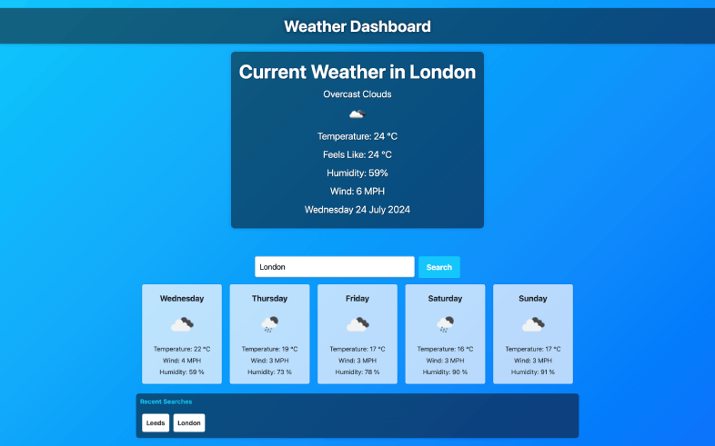

# Server-APIs-Weather-Dashboard

Server APIs allow developers to access their data and functionality by making requests with specific parameters to a URL. Developers are often tasked with retrieving data from another application's API and using it in the context of their own. My challenge is to build a weather dashboard that will run in the browser and feature dynamically updated HTML and CSS.

 
## User Story

```text
AS A traveler
I WANT to see the weather outlook for multiple cities
SO THAT I can plan a trip accordingly
```

## Acceptance Criteria

* Create a weather dashboard with form inputs.
  * When a user searches for a city they are presented with current and future conditions for that city and that city is added to the search history
  * When a user views the current weather conditions for that city they are presented with:
    * The city name
    * The date
    * An icon representation of weather conditions
    * The temperature
    * The humidity
    * The wind speed
  * When a user view future weather conditions for that city they are presented with a 5-day forecast that displays:
    * The date
    * An icon representation of weather conditions
    * The temperature
    * The humidity
  * When a user click on a city in the search history they are again presented with current and future conditions for that city

## Design

* Mobile first design, responsive to all screen sizes. 

The following image shows the web application's appearance and functionality:



* The URL of the functional, deployed application: 
https://tamarajoniec.github.io/Server-APIs-Weather-Dashboard/

## Licence

* MIT Licence
 
## References
https://www.educative.io/answers/difference-between-d-flex-and-d-inline-flex-in-bootstrap-4

https://tobiasahlin.com/blog/move-from-jquery-to-vanilla-javascript/

https://openweathermap.org/forecast5

https://getbootstrap.com/docs/4.6/getting-started/introduction/

https://uigradients.com/#DarkSkies

https://color.adobe.com/create/color-wheel


